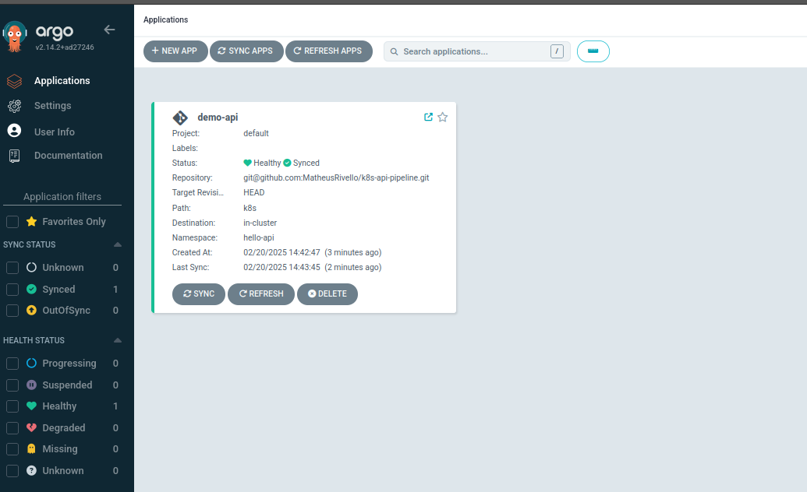
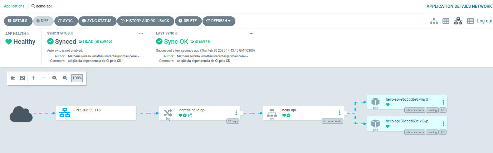

# Projeto

API em Flask com autenticação JWT, implementada com GitHub Actions para CI/CD, deploy automatizado no Kubernetes via ArgoCD.

## Continuous Integration

A integração contínua (CI) é gerenciada através do GitHub Actions. Quando um novo código é enviado para o repositório, o pipeline automaticamente:

- Realiza o build da imagem Docker e envia para o Dockerhub
- Altera a tag da imagem Docker no manifesto kubernetes do deployment

## ArgoCD Deploy

O deploy da aplicação é realizado através do Argo CD, uma ferramenta declarativa de CD (Continuous Delivery) para Kubernetes. O Argo CD monitora o repositório e sincroniza automaticamente as mudanças com o cluster, garantindo que o estado desejado da aplicação seja mantido.

